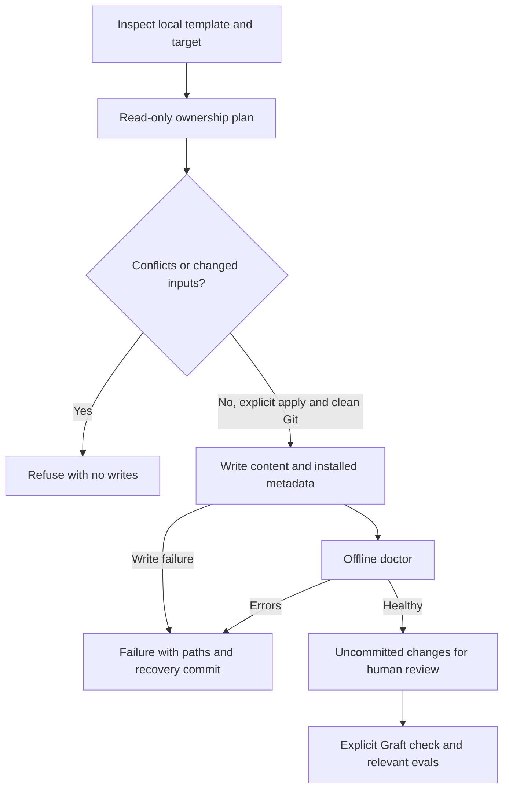

# Safe adoption and updates

Use a local template checkout and Python 3.12+ factory tooling. Existing application
Python requirements, virtual environments, dependency settings and lockfiles are
project-owned, including Python 3.11 projects. No project command runs during
inspection or planning.

```bash
uv run --no-project --isolated --python 3.12 python factory adopt /path/to/project
uv run --no-project --isolated --python 3.12 python factory adopt /path/to/project --apply
uv run --no-project --isolated --python 3.12 python factory update /path/to/project
uv run --no-project --isolated --python 3.12 python factory update /path/to/project --apply
```

`--template /path/to/template` selects an explicit source checkout. Template and
target cannot overlap. Without `--apply`, the commands print ADD, MERGE, PRESERVE,
CONFLICT and SKIP actions and leave the target unchanged. A plan with conflicts
returns exit 1. Invalid arguments return exit 2.

The initial supported target has `pyproject.toml`, a literal `check:` Makefile
target and initialized `openspec/config.yaml`. Detection does not establish that
arbitrary Make syntax or project commands work; review and run your canonical
check separately. Unsupported or uncertain tooling produces a conflict instead
of fabricated commands. Existing CI, project docs, application source and AGENTS.md
remain untouched. No upstream specifications or OpenSpec-generated tools are copied.

CLAUDE.md, Makefile integration targets and .gitignore use named
`factory:integration:begin` / `factory:integration:end` regions. Surrounding bytes
survive updates. Colliding Makefile target names require manual region reconciliation;
the engine does not parse arbitrary Make syntax. `make factory-check` supplies
quiet offline doctor and growth checks alongside a project's canonical `make check`.
The starter's canonical check already includes them. Existing project check recipes
are not replaced. Existing hook JSON retains unrelated values, permissions and
statuslines; serialization can change JSON whitespace. Factory hook identity is
limited to the shipped protection scripts. Conflicting factory hooks are not merged
semantically.

## External setup and successful application

Initialize OpenSpec before applying and commit its project configuration. Graft's
Node.js 22.12+ dependency and unchanged upstream skill remain explicit external
setup. No network install, graph copy, automatic hook or upstream init is performed
by adopt/update. For an already installed target use `make graft-install`.
For a new target, inspect the offered package and lockfile and prepare that isolated
dependency and skill separately, or use the reported failed-postcheck recovery flow
below after the first apply. Graft graph freshness is always a separate explicit
build/check, including the accepted no-application disposition.

Apply requires a clean committed Git repository root and unchanged plan inputs.
All conflicts and unsafe destinations refuse mutation. The operation leaves its
changes uncommitted and runs offline doctor. Missing external prerequisites or any
other doctor error produce **FAIL**, never a successful-installation claim. Fix
external setup, rerun doctor and inspect the recorded diff before committing;
otherwise recover using the reported commit and affected files.

Writes are not a filesystem transaction. On write or postcheck failure the report
lists the recovery commit, affected files and created directories. Restore tracked
paths with `git restore --source=<reported-commit> -- <affected-paths>`; inspect
`git status` and remove only newly created files listed by the operation. There is
no automatic rollback. Concurrent filesystem replacement is outside the supported
stationary-input model; do not edit a target while applying a plan.

## Distribution and installed baselines

`.harness/template-manifest.json` retains full distribution hashes and history,
explicit ownership, per-scope upstream hashes and preserved `project` overrides.
`.factory/state.json` is the installed authority: schema version, installed release
and per-scope upstream fingerprints. Neither metadata file fingerprints itself;
state contains no workflow status. Doctor validates state/manifest agreement and
owned representations; a valid local customization is not automatically corruption.
Required protection/wiring checks can still reject a customization that disables
installation functionality.

Updates replace pristine content when upstream changes, preserve local-only edits
and local deletion when upstream is unchanged, and refuse dual changes. Converged
content advances to the reconciled baseline. Upstream removals are shown explicitly
and preserve local files and historical baseline evidence. No conflict advances a
baseline or installed version.

Before conversion, supported legacy manifest/version/stamp records must agree.
Historical pristine hashes provide evidence; unknown customized content conflicts.
A pristine legacy Makefile without markers still needs explicit region conversion
to preserve its canonical recipe. Once converted, state supersedes legacy version
stamps, which remain historical conversion inputs. Unknown schemas refuse parsing.

Both old script paths now delegate to the same planner and apply engine. Positional
targets and `--dry` remain supported; `--dry-run` is an alias. Default calls now plan
only: applying requires `--apply`. `--force` is rejected with no writes. Old mutation
helpers, automatic migration branches and migration-report/stamp writers are retired.
The apply report and Git diff are the review artifacts.

On the starter, `make manifest` regenerates distribution metadata and the starter's
installation baselines deterministically while preserving project overrides and
hash history. This maintainer script is not shipped to downstream projects; it is
not a repair command for downstream conflicts. Refresh after template-owned edits,
then prepare Graft and obtain independent maintainability/verifier evidence.


