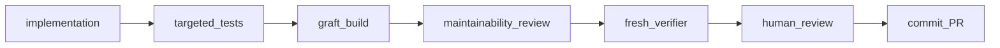

# Legacy OpenSpec Migration: factory-phase2

## Status
Unmigrated / Requires review
Evidence classification: UNKNOWN (all tasks checked; merge not inferred)

## Original sources
- `openspec/changes/factory-phase2/.openspec.yaml`
- `openspec/changes/factory-phase2/design.md`
- `openspec/changes/factory-phase2/feasibility-assessment.md`
- `openspec/changes/factory-phase2/implementation-report.md`
- `openspec/changes/factory-phase2/intent.md`
- `openspec/changes/factory-phase2/program-design.md`
- `openspec/changes/factory-phase2/proposal.md`
- `openspec/changes/factory-phase2/specs/factory-installation/spec.md`
- `openspec/changes/factory-phase2/specs/factory-maintainability/spec.md`
- `openspec/changes/factory-phase2/specs/factory-navigation/spec.md`
- `openspec/changes/factory-phase2/tasks.md`
- `openspec/changes/factory-phase2/verification-report.md`

## Original intent

### Source: openspec/changes/factory-phase2/intent.md

# Intent: factory-phase2

Workflow: DEEP
Reason: Maintainability gates, source navigation, and safe adoption/update introduce cross-cutting contracts and migration boundaries.

## Classification

New capabilities `factory-maintainability`, `factory-navigation`, and
`factory-installation`. Preserve existing submission and credential-free eval
contracts and the implemented Phase 1 workflow. Its specifications remain in
`openspec/changes/software-factory/specs/`; do not archive them implicitly.

## Problem

The factory has no deterministic source-growth gate or generated navigation
index. Migration and update use separate ownership lists; the template manifest
currently includes whole project instruction, build, CI, and documentation files.
There is no shared deterministic installation health check or per-installation
upstream fingerprint for distinguishing local changes from upstream changes.

## Proposed outcome

Implement the Phase 2 requirements in the repository-root `idea.md`: concrete
maintainability guidance and independent review, Graft-backed implementation
navigation, and one doctor/maintainability/adopt/update interface over shared
lifecycle code. Navigation uses the upstream `/graft` skill and CLI.

## Accepted decisions

The user requested implementation of `idea.md` and explicitly confirmed:

- Evolve existing migration/update tooling into one shared engine with
  compatibility entry points; mixed ownership uses bounded sections and
  installation fingerprints are recorded separately.
- Upgrade the project and factory tooling to Python 3.12+; maintaining Python
  3.9 updater compatibility is unnecessary.
- Default warning threshold: 300 code lines; maximum: 500 code lines.
- Existing oversized files require 150 net added code lines to fail on growth.
- These thresholds are project-configurable. Blank lines, comment-only lines,
  and Python docstrings do not count.
- Create the Phase 2 branch from main. `feat/factory-phase2-g1` was created
  from `35d871f`, which includes Phase 1.
- The user accepted the architecture and three capability deltas on 2026-09-10,
  authorizing program design and task-group preparation.

## Accepted navigation revision — 2026-09-11

The user approved replacing CODEMAP with Graft and explicitly requested updates
to proposal, design, program design and tasks. This supersedes the original
brief's committed CODEMAP, custom analyzer/renderer and annotation requirements.
Use a local ignored graph and on-demand review evidence. Preserve the merged
300/500/150 policy, Code Shape planning, and independent maintainability review.
Use structural builds by default, optional explicit deep enrichment, no automatic
hooks, and non-refreshing queries during read-only review. Group 1 is merged;
group 2's paused custom CODEMAP work is not an accepted deliverable.

## Constraints

Preserve FAST/STANDARD/DEEP, OpenSpec ownership, DEEP program design, independently
shippable groups, fresh behavioral verification, human gates, compact checks,
selective skills, and context boundaries. Keep factory-owned tooling stdlib-only; Graft is an explicit external navigation
dependency. Do not modify
canonical specs directly, application ownership, or unrelated project settings.
Do not commit, publish, or archive without the existing human gates.

## Open questions

The user accepted program design and shipping groups on 2026-09-10 and
authorized group 1 implementation. No unresolved group 1 design choice remains.

## Areas of concern

- Legacy migration supports destructive `--force`; it cannot silently retain
  that behavior under the approved preservation contract.
- Existing upstream hash history is not a per-installation baseline. Unknown
  customizations require conflicts, not guessed ownership.
- Phase 1 is merged but not archived in this checkout. Preserve its artifacts
  and reference its implemented contracts without taking over archive work.
- Existing large harness scripts must remain reviewable without causing every
  unrelated change to fail.

## Navigation scope clarification — 2026-09-11

The user explicitly excludes all factory and harness tooling from the graph.
Graft navigation focuses only on the main project implementation. Hidden-harness
coverage is no longer an integration requirement; application coverage and tooling
exclusion must be verified instead.

No-application behavior accepted 2026-09-11: when no application sources are
configured, report `not applicable: no application sources configured`. Validate
Graft against an application fixture; retain tooling growth and behavioral gates.
Document `/graft` usage in HARNESS.md.

### Approved skill-only integration — 2026-09-11

Graft 0.18.0's Claude installer adds hooks despite `--no-hooks`. The user approved
installing only its unchanged upstream skill and isolated CLI. Preview skill
installation, preserve customized skill files, and do not run upstream `init`.
The generated skill stays upstream-owned and ignored; `make graft-install`
regenerates it from the locked package without hooks, MCP or global agent wiring.

The factory's `.harness/bin/graft` launcher delegates through `factory navigation`
to the thin `graft.py` boundary. `project.navigation.application_roots` in the
existing manifest records the explicit application input list (empty in this
starter), forwarded as upstream `--only-dir` options. Graft still owns all graph
and cache formats. The launcher checks the pinned release, disables dotenv and
query refresh, and detects a mismatch with upstream's cached scope metadata.
This input list is not an alternate graph/configuration store. Supported review
commands are check, ask, grep, skeleton, callers, map and blast; structural build
and explicit optional `build --deep` belong to the implementer. Upstream visual
exports remain optional, outside the required read-only command surface.

### Source: openspec/changes/factory-phase2/proposal.md

## Why

The factory cannot currently detect harmful file growth, generate implementation
navigation, or validate an installation. Its separate migration/update paths and
whole-file template ownership make preserving downstream customizations harder.

## What Changes

- Add a short maintainability contract, configurable code-line growth checks,
  reasoned exceptions, and a fresh read-only maintainability reviewer.
- Default to a 300-code-line warning, 500-code-line maximum, and 150 net added
  code lines for substantial growth of existing oversized files.
- Require Code Shape planning for new DEEP program designs; surface structural
  divergence as review concerns rather than behavioral failures.
- Integrate upstream Graft through `/graft` and its CLI for implementation
  navigation of the project application only, excluding factory and harness tooling.
  Build its local structural cache before reviews; use on-demand
  change-impact reports or visualization rather than a committed CODEMAP.
- Remove the proposed in-house analyzer, graph schema, renderer and annotation
  store. Keep semantic enrichment optional and independent reviews non-mutating.
- Add one factory interface for doctor, maintainability, adopt, and update, extending the
  existing lifecycle implementation and manifest rather than replacing them
  with a parallel framework.
- Add explicit full-file, bounded-section, and preserve ownership plus
  installation-specific upstream fingerprints.
- **BREAKING**: require Python 3.12+ for the project and factory tooling.
- **BREAKING**: legacy migration force mode must no longer bypass protection of
  project-owned or conflicting content; report actionable conflicts instead.

## Capabilities

### New Capabilities

- `factory-maintainability`: source-growth enforcement, exceptions, code-shape
  planning, and independent maintainability review.
- `factory-navigation`: Graft-backed navigation, local-cache freshness and
  review evidence, without assuming behavioral or architectural authority.
- `factory-installation`: healthy installation validation, ownership-aware
  adoption, and safe factory updates.

### Modified Capabilities

None of the current canonical capabilities changes. The Phase 1 workflow and
verification deltas remain in their existing change until separately archived;
the new capabilities add requirements without rewriting those pending deltas.

## Impact

Workflow: DEEP. Architecture-affecting: yes, shared lifecycle ownership and new
verification/navigation boundaries. Affects harness scripts, template packaging,
agent instructions, workflow docs, Python configuration, CI, and static/fixture
evals. Factory-owned tooling remains stdlib-only; navigation adds the external
`@nanonets/graft` package and Node.js 20+. Preserve the existing human shipping
gate. Pin and validate the dependency during integration, rather than implicitly
tracking upstream latest.
Source requirements are `idea.md`, amended by the decisions in `intent.md`.

### Approved skill-only integration — 2026-09-11

Graft 0.18.0's Claude installer adds hooks despite `--no-hooks`. The user approved
installing only its unchanged upstream skill and isolated CLI. Preview skill
installation, preserve customized skill files, and do not run upstream `init`.
The generated skill stays upstream-owned and ignored; `make graft-install`
regenerates it from the locked package without hooks, MCP or global agent wiring.

The factory's `.harness/bin/graft` launcher delegates through `factory navigation`
to the thin `graft.py` boundary. `project.navigation.application_roots` in the
existing manifest records the explicit application input list (empty in this
starter), forwarded as upstream `--only-dir` options. Graft still owns all graph
and cache formats. The launcher checks the pinned release, disables dotenv and
query refresh, and detects a mismatch with upstream's cached scope metadata.
This input list is not an alternate graph/configuration store. Supported review
commands are check, ask, grep, skeleton, callers, map and blast; structural build
and explicit optional `build --deep` belong to the implementer. Upstream visual
exports remain optional, outside the required read-only command surface.

## Decisions already made

### Source: openspec/changes/factory-phase2/design.md

## Context

See `proposal.md` for scope and `intent.md` for user-accepted decisions.
Architecture and capability deltas accepted by the user on 2026-09-10.
Navigation revised with user approval on 2026-09-11: use Graft in place of
custom CODEMAP generation and its committed artifact.
Program design and task groups are reviewed separately before implementation.

Phase 1 inspection at main `35d871f` confirmed:

| Contract | Existing implementation |
|---|---|
| Tier routing and human gates | `FACTORY.md`, root `CLAUDE.md` |
| DEEP program design | `.claude/skills/shape-change/SKILL.md` |
| One group/branch/PR and selective context | `.claude/commands/dev-change.md`, its shell preamble |
| Fresh read-only verifier | `.claude/agents/verifier.md` |
| Quiet non-mutating full gate | `.harness/scripts/cmd_check.sh`, `lib/run_quiet.sh` |
| Template version and upstream history | `.harness/TEMPLATE_VERSION` (1.5.0), `template-manifest.json` |
| Manifest generation | `.harness/scripts/generate_template_manifest.py`, `make manifest` |
| Adoption precursor | `.harness/scripts/migrate_to_framework.py` |
| Update precursor | `.claude/skills/setup-update/scripts/setup_update.py` |
| Installation stamps | `.claude/template-version.json`, migration report |
| Static and prompt evals | `.harness/evals/`, `make evals`, `make evals-full` |

These are source inspection findings, not new execution-test results. The Phase 1
report records prior verification. Phase 2 must produce its own evidence.

## Goals / Non-Goals

Keep language-neutral configuration, deterministic factory-owned tooling, and small
modules under the existing harness. Maintain one ownership authority for both
old and new lifecycle entry points. Make navigation inexpensive and review
concerns concrete. Preserve all Phase 1 stage and shipping boundaries.

Exclude a language server, perfect dynamic call graphs, automatic refactoring,
AI merges, Wayfinder, package-release infrastructure, and new workflow-state
documents. Python remains the growth-check adapter. Graft owns navigation analysis; report
its actual supported scope rather than promising universal coverage.

## Decisions

### Runtime and interface

Use Python 3.12+ across tooling, dependency metadata, lockfile, Ruff, mypy, CI,
setup checks, and documentation. Standalone CLI entry points check the runtime
and explain how to obtain a supported interpreter. Hooks retain their existing
security behavior during migration. Existing downstream application Python
requirements, environments and lockfiles remain project-owned; use isolated
Python 3.12+ factory tooling as established by the group 1 review correction.

Provide a repository-root `factory` executable, backed by cohesive modules under
`.harness/`, with doctor, maintainability, adopt, and update subcommands.
Document `./factory` as the portable invocation; no global installation or PATH
mutation is required. Keep `make manifest` as the existing refresh operation.
Existing migration/update scripts delegate to the shared lifecycle engine.
Navigation uses upstream `/graft` and the Graft CLI, not a `factory map` alias.
Graft advertises Node.js 20+, but the selected lockfile requires Node.js 22.12+; its package/runtime remain separate from downstream
application dependencies. Select and test a pinned release during integration.

### Configuration and installation metadata

Extend `.harness/template-manifest.json` with a schema version, defaults, and
ownership metadata. Preserve `template_version`, file hashes, and hash history.
Put project overrides in its clearly separated project configuration section.
Record the tested Graft dependency and integration contract in factory metadata;
leave graph format and navigation settings with Graft rather than inventing a
parallel annotation store. Manifest regeneration preserves these overrides;
updates merge factory metadata without replacing project configuration.

Keep `.harness/TEMPLATE_VERSION` as the version source; a completed Phase 2
release uses 2.0.0 because runtime and ownership contracts change. Do not add a
second human configuration file or a redundant version authority.

Use `.factory/state.json` only for installation metadata: installed version and
upstream fingerprints for owned files or sections. It contains no task status.
Unknown schema versions fail with remediation rather than guessed parsing.

### Code-line accounting and growth

Use Python tokenization and AST docstring locations to count physical lines
containing code, excluding blank lines, comment-only lines, and docstring-only
lines. A line containing code plus a comment or docstring still counts. Regular
multiline string data is code, not documentation. Syntax errors are reported as
analysis failures rather than interpreted as zero lines.

Retain physical LOC separately from growth-policy code lines. Discover tracked and
non-ignored untracked source, including hidden harness tooling. Ignore deleted
files, caches, vendored dependencies, and generated artifacts through documented
source classification and explicit reasoned exceptions. Do not follow symlinks
outside the repository or inspect environment-secret files.

During verification compare the working tree, including staged/unstaged and
untracked changes, with the merge base resolved by the existing base-branch
contract. Preserve rename identity where Git identifies it so moving an existing
large module does not automatically make it a new pathological file. Missing
comparison history must be explicit; full-repository inspection can warn about
existing sizes but must not invent growth evidence.

| Condition, without exception | Outcome |
|---|---|
| At most 300 code lines | Pass |
| More than 300, at most 500 | Warning |
| New file with more than 500 | Failure |
| Existing file with more than 500 and at least 150 net added lines | Failure |
| Existing file with more than 500 and smaller growth | Warning |
| Deleted file | Ignore |
| Valid path-specific exception | Report exception and reason; exempt from size failure |

Thresholds and enabled state are configurable. Validate positive integer values,
warning below maximum, and a positive substantial-growth threshold. Exact-path
exceptions require nonempty reasons, existing regular files, unique normalized
paths, and repository containment. V1 rejects wildcard exception entries; an
explicit project-wide disabled setting is visible and distinguishable from a
malformed configuration. Exceptions are checked-in reviewer-visible decisions,
not something the implementation agent silently grants itself to pass a gate.

### Maintainability review and lifecycle

Keep the short policy in harness documentation and reference it at relevant
stages. New DEEP program designs require Code Shape: reused modules, new modules
and public surfaces, modules intentionally not extended, and rough footprint.
Do not retrospectively rewrite accepted Phase 1 designs. STANDARD can abbreviate
this in design.md.

The fresh read-only reviewer discovers the diff, relevant accepted design,
immediate neighbours, and deterministic growth output. It receives identifiers,
not implementation narrative. It reports PASS or CONCERNS with M-identifiers,
locations, problems, consequences, and specific directions. Structural drift,
duplication, coupling, or needless abstractions are review concerns; they do not
independently prove behavioral failure. Return concerns to the implementer or
human; the reviewer never edits. Avoid speculative interfaces, frameworks,
one-function fragmentation, and generic utilities.

FAST can skip the semantic reviewer; deterministic growth still joins the full
gate. Doctor must never call make check. Structural Graft build occurs once at completion,
not in a post-tool hook. Human review reads specs, design, relevant Graft impact evidence, diff, and
both review outputs. Preserve the existing verifier/shipping full-gate ownership.

### Graft navigation and review evidence

Delegate navigation to [trailhq/Graft](https://github.com/trailhq/Graft), exposed
through its `/graft` skill and CLI. Remove the custom Python navigation analyzer,
normalized graph schema, Markdown/Mermaid renderer, `project.codemap` annotations,
`factory map`, and committed CODEMAP artifacts from the deliverables. Keep the
Python source counter used by the already-merged maintainability gate.

The chosen contract is local navigation, not a checked-in snapshot: build the
structural graph before review, inspect it progressively, and attach relevant
on-demand impact reports or exported visualization to human review when useful.
There is no requirement to produce an export for every small change. OpenSpec
remains behavioral truth; designs explain intent; source is implementation truth;
Graft is navigation evidence. Optional generated summaries are not authoritative.

Graft owns its git-ignored cache, upstream graph schema and skill. The factory
owns only the pinned dependency integration, lifecycle guidance and checks.
Do not vendor a fork of its parser or duplicate its concept/annotation store.
Its semantic `--deep` processing remains explicitly opt-in and outside mandatory
credential-free gates. Structural navigation must work without model credentials.

Preview initialization before applying it. Keep wiring repository-local, preserve
existing instructions and statusline, disable automatic hooks, and avoid global
agent-configuration changes. Validate the selected release's initialization flags
rather than assuming upstream defaults fit this harness. Do not turn on automatic
context injection or graph mutation in fresh reviewer sessions.

Implementation runs `graft build` at the completion boundary. Reviewers run
`graft check` and retrieval with `--no-refresh` or `GRAFT_NO_REFRESH=1`.
Stale/missing cache returns control to the implementer; reviewers never build it.
CI creates its own structural cache as preparation, then checks freshness. A
fresh cache check proves local freshness, not a committed artifact's currency.
Human review can use `graft blast` output or visualization exports; no automatic
PR comments, publishing or browser launch is required.

Documentation basis: [upstream CLI and integration](https://github.com/trailhq/Graft#cli)
and [runtime dependency](https://github.com/trailhq/Graft/blob/main/package.json).
Group 2 validates the installed release through fixture tests; this includes
compatibility check before committing to installation wiring.

### Ownership, adoption, and update

Use the existing manifest allowlist as the starting inventory, then classify
each entry as full-file ownership, bounded-section ownership, or preserve.
Factory policy, shipped commands/hooks, and runtime modules can be fully owned.
Root instructions and Makefile additions use named marker regions. Project
source, existing CI, and project documentation remain project-owned. Existing
JSON hook configuration requires a structural merge retaining unrelated values;
conflicting factory hook settings are surfaced, not overwritten.

Adopt accepts an explicit target and local template checkout. Initial source
distribution remains a local checkout, matching the existing scripts; no network
fetch or new registry is needed. Inspection proposes detected build/test tools
and preserves canonical commands. Python is the first fully supported adoption
path; other detected stacks receive conservative plans with unsupported steps
identified, never fabricated checks or wholesale Python project replacement.

Default adopt/update invocations are read-only plans listing ADD, MERGE,
PRESERVE, CONFLICT, and SKIP. `--apply` rechecks the plan against current input.
All conflicts are found before writes; an unresolved conflict prevents apply.
Require a clean committed target Git worktree for mutation, record its recovery
commit, and leave resulting changes uncommitted. Reject unsafe paths, symlink
escapes, malformed marker regions, and unsupported ownership metadata before
writing. Never claim ownership outside the explicit inventory.

Install required OpenSpec directory structure without copying upstream specs or
claiming CLI-managed OpenSpec artifacts. Automatically run doctor after apply;
report failed postchecks with recovery instructions and never claim success.

Updates compare each local file/section and proposed upstream content with its
recorded upstream fingerprint:

| Local changed | Upstream changed | Action |
|---|---|---|
| No | No | Preserve |
| No | Yes | Replace owned content |
| Yes | No | Preserve local content |
| Yes | Yes | Conflict, unless local already equals new upstream |

Treat local deletion as a local change. For dual changes, reporting a conflict is
the v1 deterministic strategy; a three-way merge is optional in the source brief
and would require storing retrievable base content. Do not add that machinery
until it is justified. Bounded-section updates preserve all surrounding bytes.
Advance fingerprints only for successfully reconciled entries; a conflict must
not be hidden by updating its baseline or installed-version stamp.

Legacy hash matches can identify pristine files; unmatched legacy contents remain
customizations. The first conversion previews new ownership and baseline state.
Recognize legacy version stamps for migration, then use the shared state model.
Keep legacy script paths and dry-run options, with clear deprecation guidance;
reject legacy `--force` when it requests forbidden overwrite behavior.

### Doctor, dogfooding, and validation

Doctor independently validates manifest/version/state consistency, directories,
commands and hook wiring, applicable executable bits, OpenSpec structure,
gitignore and secret protections, maintainability settings and exceptions,
Graft dependency/wiring/application paths, and eval configuration. Findings identify a path,
severity, and remediation. Invalid installation structure fails. Doctor reports
freshness not assessed and directs users to explicit `graft check`, where stale
structural navigation fails. The user accepted this offline boundary on 2026-09-12
because pinned Graft 0.18.0 performs background registry upkeep on CLI checks. Missing Graft
or incompatible wiring is an installation error. Doctor never builds the cache
or installs a dependency.

The offline OpenSpec check validates one top-level inline schema name: a letter
or underscore followed by letters, digits, underscores, dots or hyphens, optionally
single/double quoted with a trailing comment. Empty values, duplicate declarations
and unquoted null/booleans fail. Other YAML representations require normalization
to this documented form; doctor does not parse the whole YAML document or resolve
custom schema availability. Keep this structural guarantee distinct from OpenSpec
consumer validation.

The starter uses the same installation contracts; make manifest refreshes both
distribution metadata and starter baselines deterministically. Doctor validates
owned content against expected metadata without treating recorded downstream
customizations as corruption. Add doctor to the full gate and CI without a loop.

Use semantic fixture tests for line boundaries, comments/docstrings, grandfathered
growth, exceptions, renames, Graft adapter contracts and read-only queries,
adoption preservation, clean-worktree requirements, and the update truth table.
Test conflicting and missing metadata, deleted files, changed marker sections,
and unknown legacy customizations. Static evals verify lifecycle and read-only
review contracts. Prompt evals cover only agent behavior that static checks
cannot establish; report authentication gaps honestly.

## Risks / Trade-offs

- A 500-code-line limit may encourage fragmentation → short cohesion policy,
  explicit exceptions, and a reviewer that discourages needless abstraction.
- Net growth does not detect large rewrites of unchanged size → semantic review
  covers responsibility and duplication; line checks remain a narrow signal.
- Growth remains Python v1; Graft has its own language coverage → report each
  tool’s scope separately and validate application coverage and factory/harness exclusion on a real fixture.
- External CLI/skill behavior can change → pin a tested release, preview wiring,
  and test cache, hook, statusline and read-only boundaries before upgrades.
- One manifest holds generated metadata and project settings → separate fields,
  preserve overrides on regeneration, and test update behavior.
- Legacy ownership is ambiguous → preview conflicts; never infer permission to
  replace customized whole files or claim existing project content.
- Filesystem failure after writes start → clean Git baseline plus documented
  created paths and recovery instructions; report partial failure, not success.
- Full Phase 2 is too broad for a casual single PR → shape independently
  shippable groups after architecture acceptance; do not conflate branch creation
  with approval to implement every future group on that branch.

## Migration Plan

After architecture acceptance, prepare Code Shape and independently shippable
groups with tests and integration in each. Keep the first group on the created
`feat/factory-phase2-g1`; later dependent groups wait for their prerequisites.
Preserve Phase 1 change artifacts. Upgrade runtime and contracts together where
their shipping boundary requires it. Update the manifest using make manifest,
build the Graft structural cache at implementation completion, and run independent reviews.

Downstream adoption/update apply remains explicit and produces uncommitted Git
changes. Humans inspect the printed actions, resulting diff, doctor, Graft freshness check,
and relevant eval evidence before committing. Rollback restores only paths and
managed regions reported by the operation from the recorded clean Git baseline;
no automatic reset, clean, or hidden backup directory is introduced.

### Application-only navigation scope — 2026-09-11

The user clarified that Graft graphs cover the main project implementation only.
Exclude factory and harness tooling, including tooling outside hidden directories.
Use upstream scope controls to select application source roots; do not infer graph
scope from dot-directory exclusion alone. This does not narrow source-growth
enforcement or independent source review of factory changes.

No-application behavior accepted 2026-09-11: when no application sources are
configured, report `not applicable: no application sources configured`. Validate
Graft against an application fixture; retain tooling growth and behavioral gates.
Document `/graft` usage in HARNESS.md.

### Approved skill-only integration — 2026-09-11

Graft 0.18.0's Claude installer adds hooks despite `--no-hooks`. The user approved
installing only its unchanged upstream skill and isolated CLI. Preview skill
installation, preserve customized skill files, and do not run upstream `init`.
The generated skill stays upstream-owned and ignored; `make graft-install`
regenerates it from the locked package without hooks, MCP or global agent wiring.

The factory's `.harness/bin/graft` launcher delegates through `factory navigation`
to the thin `graft.py` boundary. `project.navigation.application_roots` in the
existing manifest records the explicit application input list (empty in this
starter), forwarded as upstream `--only-dir` options. Graft still owns all graph
and cache formats. The launcher checks the pinned release, disables dotenv and
query refresh. Upstream owns fingerprint selection and validation; the wrapper
does not inspect fingerprint files. Changing application roots requires an
explicit build before review because upstream checks the last-built scope.
This input list is not an alternate graph/configuration store. Supported review
commands are check, ask, grep, skeleton, callers, map and blast; structural build
and explicit optional `build --deep` belong to the implementer. Upstream visual
exports remain optional, outside the required read-only command surface.

### Source: openspec/changes/factory-phase2/program-design.md

# Program Design

Architecture: accepted `design.md`. The user accepted this program design and
`tasks.md` on 2026-09-10 and authorized group 1 implementation. Implementation
completion is recorded only by verified task claims in `tasks.md`.

## Code Shape

### Existing modules reused

- `.harness/scripts/lib/change.sh`: canonical base resolution and merge-base
  semantics; invoke through an argument-safe subprocess, not interpolated shell.
- `.harness/scripts/lib/run_quiet.sh`: concise successful full-gate output and
  complete failure output.
- `.harness/scripts/generate_template_manifest.py`: retain inventory discovery,
  version source, and hash-history behavior; delegate metadata validation and
  ownership extraction to the shared engine when introduced.
- `.harness/evals/run_evals.py`: retain static/prompt case discovery and reporting.
- Existing migration/update inspection and Git preflight behavior: move useful
  behavior into cohesive lifecycle modules, preserving supported CLI contracts
  through adapters and testing documented intentional changes.

### New modules

All Python runtime modules live in `.harness/factory/`, imported by a thin root
`factory` launcher. This is an ordinary package, not an application under src.

| Module | Responsibility | Intended public surface |
|---|---|---|
| `cli.py` | Argument parsing, root selection, dispatch, exit codes | `main(argv) -> int` |
| `config.py` | Manifest schema, defaults, project overrides and validation; shared contained regular-file reads for configuration consumers | `load_config(root)`, `validate_config(root, data)`, `read_text(root, name)` |
| `source.py` | Safe repository source inventory and Python code-line counting | `discover_sources(root)`, `count_python(source) -> LineCounts` |
| `growth.py` | Merge-base comparison, rename mapping, threshold decisions | `check_growth(root, config, base) -> list[GrowthFinding]` |
| `graft.py` | Thin pinned-CLI invocation and non-mutating freshness diagnostics; no source analysis | `run(root, args)`, `application_roots(root)`, `install_skill(root, apply=...)` |
| `doctor.py` | Independent installation checks and remediation | `diagnose(root) -> list[Diagnostic]` |
| `doctor_wiring.py` | Read-only command/hook/eval/Git wiring checks used by doctor | `check_commands(root)`, `check_hooks(root)`, `check_evals(root)`, `check_git(root)` |
| `eval_config.py` | Shared pure parsing/validation for doctor and the eval runner; never executes case bodies | `parse_fields(content, label)` |
| `ownership.py` | Managed paths, section extraction and structural JSON rules | `validate_ownership(...)`, `owned_content(...)`, `merge_owned(...)` |
| `installation.py` | Group 3 legacy version reconciliation and metadata completion; group 4 adds versioned baseline state | `installation_version(root)`, `load_state(root)`, `build_state(...)`, `check_state(...)`; obsolete legacy writers removed in group 4 |
| `inspection.py` | Conservative target tool/instruction/structure discovery | `inspect_target(root) -> Inspection` |
| `adoption.py` | Inspection and ownership into read-only adoption actions | `plan_installation(template, target, operation) -> Plan` (shared adoption/update orchestration) |
| `updates.py` | Baseline comparison and legacy conversion into update actions | `classify(local, incoming, baseline)`, `legacy_baseline(...)`; shared planner lives in adoption.py |
| `apply.py` | Revalidate plans, apply safe actions, postchecks and recovery report | `apply_plan(plan) -> ApplyResult` |

Introduce each module with its first real caller, not as empty scaffolding. Keep
records with their owning capability; no generic services, repositories, or
utility package. A small concrete `Plan`/`Action` model belongs with the shared
application boundary used by adoption and update.

### Existing modules intentionally not extended

- `.harness/scripts/migrate_to_framework.py` already spans roughly 1,500 physical
  lines and combines discovery, checks, generation, mutation, and reporting.
  New lifecycle behavior goes in the shared package; this script becomes an
  adapter in the lifecycle shipping group.
- `setup_update.py` must not gain another ownership algorithm beside the shared
  planner. Its legacy interface translates arguments and reports deprecations.
- `check_feature_docs.py` retains feature-documentation responsibility; it does
  not become the growth checker or source-graph implementation.
- The eval runner keeps running cases; fixture logic belongs in tests.

### Expected implementation footprint

Approximately 10–15 runtime/launcher files across the complete change, plus
focused test modules, one reviewer definition, one policy document, and generated
upstream Graft skill wiring. Graft caches remain ignored local artifacts. Existing workflow, packaging, runtime, and CI files receive
localized integrations. Each group below names its subset; this is not a demand
to create every possible module regardless of need.

Aim for cohesive modules below 300 code lines; no new handwritten source above
500 without an explicitly reviewed exception. Split tests by independently
testable behavior if needed. Do not count generated graph/Markdown as handwritten
source. Do not pad root instructions with policy text.

## Important types and interfaces

### Configuration and diagnostics

Extend the existing JSON manifest with `schema_version`, `defaults`, and `project`
sections. Retain `template_version` and `files`. Resolve configuration by merging
documented factory defaults with project overrides; unknown configuration keys
produce diagnostics rather than silently ignoring a misspelled safety setting.

The maintainability object exposes `enabled`, `warn_file_lines=300`,
`max_file_lines=500`, `substantial_growth_lines=150`, and `exceptions` containing
`path`/`reason`. Reject booleans where integers are required. Exact normalized
paths must remain inside the repository. Source scope identifies Python v1 and
documented exclusions; unsupported languages are visible, not implicitly checked.

Factory configuration records only the tested Graft dependency/integration
contract. Graft owns navigation settings, symbols and graph storage; remove
`project.codemap` and do not introduce a replacement annotation schema.

`Diagnostic` contains a stable code, severity, optional path, explanation, and
remediation. `GrowthFinding` contains current/base paths, available code counts,
growth, status, and exception reason. CLI exit codes: 0 for success with possible
warnings, 1 for failed checks/conflicts, and 2 for invalid invocation. Errors
never disappear behind quiet output; library functions do not terminate Python.

### Source counting and Graft contracts

Preserve `LineCounts` and the existing token/AST code-line accounting unchanged.
Graft replaces only navigation analysis. No factory-owned graph records, renderer,
Mermaid escaping layer, source-hash cache or semantic annotation system is needed.

The small Graft boundary calls the upstream executable using argument arrays and
an explicit repository root. It never invokes a shell with interpolated input.
Capture exit status and actionable stderr; missing/incompatible executables are
errors, not successful empty navigation. Keep version pinning separate from the
application package manifest. Validate the selected executable/package once
installed; do not fetch packages implicitly from doctor or reviewer commands.

Expose upstream `/graft` and CLI guidance with this lifecycle contract:
- Implementer: explicit structural build after targeted tests.
- Reviewer: `graft check`, plus queries with `--no-refresh` or
  `GRAFT_NO_REFRESH=1`; never build, enrich, install, or refresh.
- CI: install the pinned dependency, prepare its local cache, then test freshness
  and integration without LLM credentials.
- Human review: relevant on-demand impact output or optional visualization export,
  not a mandatory checked-in CODEMAP diff.

Obtain the unchanged skill from the pinned package’s skill template; preview writes and
validate disabled hooks, preserved statusline, repository-local scope and no
implicit global configuration. Keep safety/lifecycle instructions in the factory
rather than forking upstream skill content. Graft’s own versioned configuration
and cache stay under its ownership. Integration tests must prove that querying
with refresh disabled leaves cache, source and configuration unchanged.

### Ownership and plan contracts

Manifest entries keep full-file distribution hashes and add explicit ownership
mode and, where needed, named section metadata. Distribution hashes verify
template contents; installation fingerprints describe the actual managed scope.
Neither manifest nor state fingerprints itself. Project fields remain outside
factory metadata replacement. Graft cache content is derived locally and never fingerprinted or copied from
the starter. Track only explicitly owned integration wiring; preserve existing
Graft configuration and report incompatible versions or ownership conflicts.

`Plan` records template/target roots, target Git baseline, observed input hashes,
actions, conflicts, and detections. Actions use ADD/MERGE/PRESERVE/CONFLICT/SKIP
with path, reason, owned scope, and proposed content where relevant. A plan is
computed in memory and printed; no workflow-status store is introduced.

Apply reconstructs/revalidates current inputs and rejects any unresolved conflict
before writing. Reject `.git` paths, traversal, malformed markers, special files,
and symlink escape paths. Mutation preflight requires a clean committed target;
read-only planning does not. Target and template must not overlap for adopt/update.

The installation record stores schema/version and per-scope upstream hashes.
For legacy content, matching a historical pristine hash is evidence; otherwise
report customization. Treat missing local content as a local edit. Upstream
removals need a visible plan and preserved customizations; do not delete files
merely because a newer manifest no longer lists them.

## Data and control flow

### Group 1: Runtime and deterministic growth

Launcher runtime guard → CLI → config validation → existing merge-base resolver
→ safe changed-source inventory → base/current token counts → policy findings.
The full gate adds this check through its existing quiet wrapper. Explicit
full-repository inspection warns on sizes with unknown history; normal diff
verification fails visibly if a requested comparison base cannot be resolved.

Ship the short policy and Code Shape template extension here. The semantic
reviewer and Graft completion instructions join together in group 2 so commands
never refer to an unavailable stage. Upgrade active Python metadata, lockfile,
CI, bootstrap checks, and emitted migration defaults together.

### Group 2: Graft navigation and independent maintainability review

First reconcile the uncommitted custom CODEMAP attempt: remove its navigation
modules, generated files, annotation settings, tests and command integrations,
while preserving group 1 source/growth code and reusable reviewer work. Scope this
cleanup to this branch’s CODEMAP additions; do not reset unrelated user edits.

Validate a pinned Graft release on a disposable fixture before wiring the starter.
Then add `/graft`, dependency setup, structural build/read-only retrieval guidance,
and the maintainability reviewer. Existing task group/branch identity remains
`factory-phase2`, group 2; no new parallel change framework is introduced.

Flow: targeted tests → Graft structural build → maintainability review → fresh
behavioral verifier → human review. Supply identifiers to fresh reviewers, never
implementation-session reasoning. Report concerns and missing evidence explicitly.
Append actual group results and deviations to implementation-report.md.

### Group 3: Installation diagnosis

Doctor reads installed manifest/version → required structure and hook/settings
checks → configuration/exception validation → offline Graft dependency/wiring checks → findings.
Freshness remains explicit `graft check`; doctor reports that freshness was not
assessed (scope correction accepted 2026-09-12). Register
only checks for functionality actually shipped at this stage. Baseline ownership
state is not made mandatory before group 4 installs it. Integrate doctor into
make check and CI without invoking make check from doctor.

### Group 4: Shared adoption/update and ownership transition

Template verification + target inspection + optional existing baseline → one
ownership model → adoption/update plan → explicit apply → clean-tree/input
revalidation → writes → baseline state → doctor and follow-up report.

Publish the complete managed inventory, markers, section payloads, and state
conversion together with both compatibility adapters. Activate doctor baseline
checks at that point. Upgrade the completed template version to 2.0.0 and refresh
starter installation metadata with make manifest. Intermediate groups preserve
working legacy behavior and do not claim the lifecycle transition is complete.

## Integration boundaries

- Use repository-root discovery independent of current working directory. CLI
  supports an explicit root; adopt/update require explicit target and a local
  template source, defaulting to the invoking checkout when it is that source.
- Reuse merge-base resolution through the existing helper, passing arguments
  positionally. Git inventories use NUL delimiters to handle unusual filenames.
- Existing `make check` remains product verification; maintainer tests remain
  `make harness-test`. Add actual factory module lint/type coverage to the
  maintainer workflow so hidden code is not silently outside validation.
- Hooks keep existing protection behavior. Doctor inspects settings without
  opening `.env`, executing project commands, or making network requests.
- Legacy script paths and dry flags remain available. Tests of supported public
  behavior persist; tests that assert forbidden force overwrites are deliberately
  replaced with explicit preservation/conflict tests in group 4.
- Human reviews and commits remain separate. Shaping cannot authorize shipping.

## Test design

### Behavior tests

Place pure policy/serialization tests in `.harness/tests/unit/` and real
filesystem/Git/CLI cases in `.harness/tests/integration/`, retaining existing
pytest markers and test conventions.

| Area | Evidence |
|---|---|
| Code counts | Blank/comment/docstring exclusion; inline code; multiline string data; async functions; encoding |
| Thresholds | 300/301, 500/501, and 149/150 boundaries; project override; disabled policy |
| Growth | New 900-line file fails; existing 900 unchanged passes; 700→950 fails; staged/unstaged/untracked; rename |
| Exceptions | 1500-line generated fixture; duplicate/missing/escaping/wildcard paths; empty reasons; invalid types |
| Graft navigation | Real pinned-release fixture covers application Python sources, excludes factory/harness tooling, and checks public surfaces, retrieval and impact evidence; do not retest every upstream parser |
| Graft integration | Previewed local wiring, preserved instructions/statusline, hooks disabled, no global agent configuration changes, isolated dependency |
| Graft checks | Missing executable, incompatible release, missing/stale cache; read-only queries/checks preserve source/config/cache bytes |
| Reviewer | Read-only tools, restricted inputs, exact PASS/CONCERNS contract, concrete drift output in a prompt eval where useful |
| Doctor | Missing commands/hooks; invalid manifest/config; absent protections; offline deferred Graft freshness; normal starter health |
| Adoption | Plan writes nothing; canonical make check and instructions preserved; Python/non-Python detections; unknown commands |
| Update | Four-way fingerprint table, convergence, local deletion, upstream removal, legacy unknown hashes, section preservation |
| Apply | Dirty target refusal; conflict preflight writes nothing; changed inputs rejected; failures report recovery paths |
| Packaging | Fresh inventory contains every runtime dependency; project overrides survive refresh; old entry points agree with new |

### Failure cases

Use disposable Git repositories for destructive-path assertions, never the user's
working checkout. Simulate a write or postcheck failure and assert failure status,
reported baseline/paths, and no false installed-success claim. Use malformed JSON,
invalid Python, broken markers, and symlink fixtures to exercise error boundaries.
Do not weaken checks to get starter dogfooding to pass.

### Neighbouring regression risks

Retain existing manifest OpenSpec ownership exclusions, migration/update safety,
base selection, feature-doc checks, shell portability, quiet failure propagation,
root instruction size budget, static eval credentials, and verifier independence.
Regenerate the template manifest after owned changes, and build the Graft structural cache after
targeted implementation tests once group 2 has shipped. Fresh verification owns
the full gate; broaden testing only for changed behavior or unresolved failures.

## Migration / compatibility

Groups ship sequentially on `feat/factory-phase2-g1` through `-g4`; each subsequent
group waits for its predecessor to merge and starts from updated main. The
already-created group 1 branch belongs to this session: do not rerun branch
creation as though it were an unclaimed branch.

Keep historical Phase 1 reports/designs unchanged. Runtime documentation refers
to 3.12 while historical records retain the version they actually verified.
The first three groups are useful incremental improvements; complete ownership
and baseline activation occurs only with group 4. Final archive waits for all
groups and the human-approved canonical spec diff.

## Least-confident decisions

- Graft’s published release, application-only scope and installation side
  effects need fixture validation. Select a pinned release and verify integration
  before adopting it; if it cannot satisfy the approved boundaries, stop and
  present evidence instead of restoring an in-house analyzer implicitly.
- Legacy arbitrary instruction/Makefile structure may prevent a clean bounded
  merge. The accepted fallback is a conflict with remediation; fixtures must
  prove preservation before extending the recognized patterns.
- Keeping project configuration in the distribution manifest makes regeneration
  delicate. Round-trip override tests and non-self-referential fingerprint rules
  are mandatory before adding update mutation.

These are bounded implementation risks with accepted safe outcomes, not unresolved
architecture choices. If evidence invalidates an accepted boundary, stop and
present the issue, consequence, and suggested revision before proceeding.

### Application-only navigation scope — 2026-09-11

The user clarified that Graft graphs cover the main project implementation only.
Exclude factory and harness tooling, including tooling outside hidden directories.
Use upstream scope controls to select application source roots; do not infer graph
scope from dot-directory exclusion alone. This does not narrow source-growth
enforcement or independent source review of factory changes.

No-application behavior accepted 2026-09-11: when no application sources are
configured, report `not applicable: no application sources configured`. Validate
Graft against an application fixture; retain tooling growth and behavioral gates.
Document `/graft` usage in HARNESS.md.

### Approved skill-only integration — 2026-09-11

Graft 0.18.0's Claude installer adds hooks despite `--no-hooks`. The user approved
installing only its unchanged upstream skill and isolated CLI. Preview skill
installation, preserve customized skill files, and do not run upstream `init`.
The generated skill stays upstream-owned and ignored; `make graft-install`
regenerates it from the locked package without hooks, MCP or global agent wiring.

The factory's `.harness/bin/graft` launcher delegates through `factory navigation`
to the thin `graft.py` boundary. `project.navigation.application_roots` in the
existing manifest records the explicit application input list (empty in this
starter), forwarded as upstream `--only-dir` options. Graft still owns all graph
and cache formats. The launcher checks the pinned release, disables dotenv and
query refresh. Upstream owns fingerprint selection and validation; the wrapper
does not inspect fingerprint files. Changing application roots requires an
explicit build before review because upstream checks the last-built scope.
This input list is not an alternate graph/configuration store. Supported review
commands are check, ask, grep, skeleton, callers, map and blast; structural build
and explicit optional `build --deep` belong to the implementer. Upstream visual
exports remain optional, outside the required read-only command surface.

### Group 4 implementation clarifications — 2026-09-15

The shared planner lives in adoption.py; updates.py supplies the fingerprint
truth table and historical evidence rather than duplicating orchestration.
State schema 1 and manifest ownership_version 1 distinguish installed baselines
from distribution hashes; owned_sha256 reconciles both records. State supersedes
legacy version stamps after conversion. The obsolete metadata-completion writer
is removed along with both legacy mutation algorithms.

Supported adoption requires Python pyproject evidence, a literal canonical check
and initialized OpenSpec configuration. Graft dependency/skill provisioning stays
external, as in group 3. Apply reports missing prerequisites as failed postchecks
with recovery, never as a successful install. Production-fixture checkpoint tests
provision external structural prerequisites explicitly; they do not establish
real Graft execution. Existing project check recipes remain byte-preserved;
make factory-check supplies separate quiet factory checks alongside them.

Known pristine unmarked legacy Makefiles still conflict pending explicit bounded
region reconciliation, because replacing them with only the incoming managed
region would lose the canonical recipe. This is the accepted conservative
conflict fallback, not automatic semantic Make parsing. JSON merges preserve
unrelated values but normalize whitespace; byte preservation applies outside
instruction/build/ignore regions. No new automatic dependency/network setup,
transactional filesystem writes, or concurrent-mutator guarantee is introduced.

## Known unresolved questions
Not inferred. Review the original sources and current code.

## Existing design constraints
Not inferred. Review the original sources and current code.

## Existing task status

### Source: openspec/changes/factory-phase2/tasks.md

# Factory Phase 2 tasks

Implementation reporting: append each completed group’s results to the shared
[implementation-report.md](implementation-report.md) before human review. Follow
its per-group structure and preserve prior evidence; use dated addenda for later
corrections. This checklist remains the authority for task completion.

## 1. Ship Python 3.12 and configurable source-growth enforcement

Branch: `feat/factory-phase2-g1`, already created from main for this session.
Prerequisites: accepted program design/tasks; no prerequisite implementation group.
Shipping boundary: usable growth command and integrated deterministic gate,
including policy, configuration, runtime upgrade, packaging, docs, and tests.
Does not introduce instructions requiring the later map/reviewer/doctor commands.

Context:
- specs/factory-maintainability/spec.md: Configurable code-line growth policy; Diff-aware evidence and explicit analysis scope; Reasoned checked-in exceptions
- specs/factory-installation/spec.md: Unified versioned factory tooling, Unsupported interpreter
- design.md: Runtime and interface; Configuration and installation metadata; Code-line accounting and growth
- program-design.md: Code Shape; Configuration and diagnostics; Group 1; Test design

- [x] 1.1 Upgrade active project/tooling requirements, bootstrap guards, migration-emitted Python settings, CI, and lockfile to Python 3.12+; verify environment sync and unsupported-interpreter diagnostics without touching targets.
- [x] 1.2 Add the thin factory launcher and shared config/source modules, extending the existing manifest with preserved project overrides; verify parsing, malformed settings, override round-trips, safe inventory, and code-line accounting fixtures.
- [x] 1.3 Implement merge-base-aware growth findings with 300/500/150 defaults, staged/unstaged/untracked coverage and rename baselines; verify exact threshold boundaries, grandfathered files, exceptions, and missing-history failures.
- [x] 1.4 Add the short maintainability policy and required Code Shape template, integrate growth into the full gate, and package the complete runtime dependencies; verify static policy/packaging evals and quiet gate failure propagation.
- [x] 1.5 Add maintainer lint/type coverage for new factory modules and run targeted tests/formatting plus manifest refresh; obtain fresh verifier evidence from make check, make harness-test, and make evals, append the group’s implementation report, then stop uncommitted for human review.

Group 1 verification evidence (2026-09-11):
- Local final `make check`: PASS after approved uv-cache access.
- Local final `make harness-test`: PASS, including factory lint/format/types and
  196 tests. `make evals`: 15/15 static cases passed; six prompt cases not run.
- Strict OpenSpec validation passed; all 94 template hashes match current files.
- Fresh verifier initially found missing verbose PASS-file evidence, a bypassed
  quiet wrapper, and incorrect tomllib-version wording. All three were corrected
  with regression coverage; the verifier confirmed those findings resolved and
  reran make check and static evals successfully.
- After resuming from its usage limit, the fresh verifier completed final checks
  against the docstring-semicolon fix and returned PASS. It independently ran
  make check, make harness-test (196 tests), make evals (15/15 static), verbose
  growth evidence, all 94 manifest-hash assertions, and docstring edge cases.
  No unresolved mismatch remains. A clean environment rebuild was not repeated;
  checks used the Python 3.12 environment. Six prompt evals were not run, and
  groups 2–4 remain outside this verification.
- No commit or PR created. Groups 2–4 have not started.

Group 1 review fixes (2026-09-11):
- The growth gate selects isolated Python 3.12 tooling without changing a
  downstream project's Python requirements, virtual environment, or lockfile.
  A migrated Python 3.11 fixture exercises the actual uv/factory invocation;
  CI installs both interpreters to run this regression.
- Manifest regeneration rejects unsupported schema versions before writing,
  while preserving legacy/schema-1 project overrides and hash history.
- Local validation: 39 targeted tests passed; make check and make harness-test
  passed (204 tests); make evals passed all 15 static cases. Six prompt cases
  were not run. Manifest refreshed; git diff --check passed.
- These are implementer checks after review fixes, not a new independent
  verifier report. Changes remain uncommitted.

## 2. Ship Graft navigation and independent maintainability review

Branch: `feat/factory-phase2-g2`. Prerequisite: group 1 merged (satisfied).
Navigation revision accepted 2026-09-11. This replaces the uncompleted custom
CODEMAP plan; no earlier CODEMAP test run counts as Graft integration evidence.
Shipping boundary: validated upstream Graft skill/CLI, local-cache lifecycle,
reviewer, documentation, packaging and tests ship together. No committed map,
in-house graph schema/analyzer/renderer, or factory map command is required.

Context:
- specs/factory-navigation/spec.md: all requirements
- specs/factory-maintainability/spec.md: Code-shape planning and narrow independent review; Maintainability joins existing completion boundaries
- design.md: Graft navigation and review evidence; Maintainability review and lifecycle
- program-design.md: Source counting and Graft contracts; Group 2; Test design

- [x] 2.1 Remove the paused custom CODEMAP navigation implementation, generated artifacts, annotations and integrations while retaining merged growth checks and reusable reviewer work; verify the diff contains no unrelated reversions and no active CODEMAP command/schema dependencies.
- [x] 2.2 Select and validate a pinned Graft release with Node.js 22.12+ tooling (the locked dependency minimum) isolated from application dependencies, then install its unchanged upstream /graft skill directly from the package template through previewed repository-local wiring (do not run upstream init); verify application Python coverage and exclusion of factory/harness tooling, no automatic hooks, preserved instructions/statusline and no global configuration writes on a disposable fixture.
- [x] 2.3 Integrate explicit structural builds, non-mutating freshness checks and non-refreshing reviewer queries; document the local ignored cache, optional deep enrichment and on-demand impact/visualization evidence; verify no model credentials are required, read-only queries preserve source/config/cache bytes, and absent application scope reports not applicable.
- [x] 2.4 Complete the fresh read-only maintainability reviewer and tests → Graft build → maintainability → verifier → human review sequence; verify restricted inputs/tools, PASS/CONCERNS output, FAST exceptions, actionable drift findings and missing-cache disposition through static and focused prompt evals where necessary.
- [x] 2.5 Refresh packaging and navigation/review guidance (including /graft usage in HARNESS.md), remove obsolete CODEMAP CI checks, prepare Graft’s local cache in CI, and obtain independent maintainability/verifier evidence from graft check, make check, make harness-test and applicable evals; append actual group results to implementation-report.md and stop uncommitted for human review.

Group 2 final verification (2026-09-11):
The evidence below predates the human-review P2 correction. See the latest
implementation-report.md entry for the structural/enrichment gate correction and
its verification; earlier independent verdicts do not cover that correction.
- Fresh maintainability review: PASS on the final tree.
- Fresh verifier: PASS; make check, make harness-test (227 tests), make evals
  (16 static cases), diff whitespace and all 101 template hashes passed.
- Focused prompt eval 106 and independent impact/non-mutation fixture passed.
- The nested-tooling finding was fixed and re-verified. Final regressions also
  cover dotenv override rejection; no unresolved mismatch remains.
- Starter Graft build/check report the accepted no-application disposition;
  actual application graphs are exercised in disposable fixtures.
- Six unrelated prompt cases, remote Node 22 CI, optional deep enrichment and
  visualization exports were not exercised. See implementation-report.md for
  cumulative evidence, corrections and the final verifier report.
- Group 2 remains uncommitted on feat/factory-phase2-g2 for human review.
  Groups 3 and 4 remain unchecked.

## 3. Ship deterministic installation diagnosis

Branch: `feat/factory-phase2-g3`. Prerequisite: group 2 merged (satisfied).
Offline doctor scope adjustment accepted 2026-09-12: Graft freshness remains
the separate explicit check; doctor does not invoke the upstream CLI.
Shipping boundary: usable doctor for the currently shipped installation, with
actionable checks, CI/full-gate integration, documentation and fixture tests.
Per-installation ownership baselines become required only when group 4 ships them.

Context:
- specs/factory-installation/spec.md: Fast actionable installation health checks; Deterministic installation regression coverage
- specs/factory-maintainability/spec.md: Reasoned checked-in exceptions
- design.md: Doctor, dogfooding, and validation
- program-design.md: Group 3; Integration boundaries; Test design

- [x] 3.1 Implement doctor diagnostics for current manifest/version, directories, command/hook wiring, executable bits, OpenSpec, git protections, configuration/exception paths, Graft availability/version/wiring/application paths and eval configuration; verify each failure category in independent filesystem fixtures.
- [x] 3.2 Expose factory doctor and integrate it into make check/CI without recursion, while explicitly reporting that Graft freshness is not assessed offline; verify no source writes, no project-command execution, and no environment-secret reads.
- [x] 3.3 Dogfood ordinary installation health against the starter, update lifecycle documentation and manifest packaging, and add credential-free static doctor evals; verify healthy/broken fixtures, deferred freshness and starter doctor results.
- [x] 3.4 Run targeted tests/formatting, build the Graft structural cache and refresh the manifest, then obtain fresh maintainability and verifier evidence from doctor, graft check, make check, make harness-test and make evals; append the group’s implementation report and stop uncommitted for human review.

2026-09-14 review correction: all three latest findings are addressed; final
implementer gates pass (361 harness tests, 18 static evals). Version reconciliation
and eval parsing now have shared implementations and cross-consumer fixtures.
See the latest implementation-report.md addendum and
[feasibility assessment](feasibility-assessment.md). Task 3.4 remains unchecked
until fresh independent maintainability/verifier evidence covers this tree.

2026-09-14 schema review correction: doctor now validates a documented inline
OpenSpec schema-name form, rejecting empty/null-like values, duplicate declarations
and next-line spillover. Thirty added cases reproduce 23 pre-fix false passes;
all now pass. Final implementer checks: make check, 391 harness tests and 18 static
evals pass. Feasibility reassessment adds explicit group 4 decision gates. Task
3.4 remains pending fresh independent evidence; group 4 was not implemented.

2026-09-14 eighth review correction: FIFO manifest reads now share the guarded
configuration reader across doctor and navigation. A timeout-protected CLI matrix
passes 21 nonregular-input cases; make check, 412 harness tests and 18 static evals
pass. See implementation-report.md and feasibility-assessment.md for the
implementation/verifier audit. Independent evidence remains pending; 3.4 stays
unchecked.

## 4. Ship shared safe adoption, update, and ownership migration

Branch: `feat/factory-phase2-g4`. Prerequisite: group 3 merged (satisfied).
2026-09-15 human decision: proceed without refreshing group 3 verification after
the CI correction. Preserve its STALE report in history; group 4 receives its own
fresh independent review cycle. This does not retroactively verify the CI edit.
Shipping boundary: one ownership engine, per-installation state, both plan/apply
flows, and both legacy adapters migrate together. Separating their rollout would
leave entry points with conflicting preservation rules. Include all mutation
fixtures, template version/baselines, docs, and final acceptance evidence here.

Context:
- specs/factory-installation/spec.md: all requirements, particularly Explicit ownership and preserved project configuration; Inspection-first non-destructive adoption; Fingerprint-based deterministic updates; Recoverable and validated application
- design.md: Ownership, adoption, and update; Configuration and installation metadata; Migration Plan
- program-design.md: Ownership and plan contracts; Group 4; Migration / compatibility; Test design
- feasibility-assessment.md: Recommended completion sequence; Seventh review round decision gates; Eighth review round input/consumer matrix

Carry-forward constraints: reuse config.py guarded readers, installation.py legacy
version reconciliation, and eval_config.py parsing. Factory tooling requires Python
3.12+ while downstream Python metadata, environments and locks remain project-owned.
Doctor stays offline; Graft build/check is separate and no application scope remains
not applicable. No automatic Graft hooks, cache copying or upstream init.

Implementation checkpoint within this shipping group: before widening adapter and
inventory coverage, prove clean Python adoption → apply → doctor → template change
→ update → apply → doctor → unchanged repeat. Include customized instructions,
Makefile and JSON, preserved surrounding bytes, and conflict refusal with zero writes.
Stop and clarify if that bounded contract cannot be demonstrated.

- [x] 4.1 Implement explicit ownership scopes, bounded-section/structural JSON merges (JSON whitespace may normalize), and versioned installation state while preserving project overrides; explicitly distinguish distribution version, installed state authority and legacy conversion inputs before any target write; verify containment, malformed markers, hash consistency, preserved surrounding bytes and non-self-referential metadata.
- [x] 4.2 Extract conservative target inspection and implement read-only adoption plans with ADD/MERGE/PRESERVE/CONFLICT/SKIP; verify plan-only byte preservation, existing instructions/CI/canonical make check, supported tool evidence, and unsupported-stack diagnostics; require initialized OpenSpec and canonical make check, preserve its recipe and offer make factory-check alongside it.
- [x] 4.3 Implement fingerprint-based update planning and legacy baseline conversion; verify all four update outcomes, convergence, local deletion, upstream removals, historical pristine hashes and unknown customized content; unmarked legacy Makefiles conservatively conflict for explicit region conversion; never advance a conflicted baseline or stamp to satisfy doctor.
- [x] 4.4 Implement explicit apply with clean committed Git preflight, changed-input detection, all-conflict validation, state handling, doctor and recovery reporting; verify zero writes on preflight failure and honest reporting of write/postcheck failures, including failure between content and state writes, affected paths and usable Git recovery instructions; retain offline doctor and separate Graft/eval follow-up.
- [x] 4.5 Replace legacy migration/update execution paths with shared-engine adapters, retaining supported argument forms and rejecting unsafe force behavior; verify old/new entry-point agreement using the same preservation/conflict fixtures, copied-runtime dependencies and downstream Python 3.11 isolation; replace only tests for intentionally changed overwrite contracts.
- [x] 4.6 Convert the starter inventory and mixed-ownership regions, activate doctor baseline validation, set completed template version 2.0.0 and make manifest refresh behavior; verify ordinary starter doctor health, deterministic regeneration and install/update fixture round trips; set 2.0.0 only after the complete acceptance matrix passes, without masking recorded customizations as corruption.
- [x] 4.7 Update FACTORY/HARNESS/setup/review documentation and lifecycle diagrams, build the Graft structural cache and refresh the manifest, and verify command instructions plus managed dependency completeness through static evals.
- [x] 4.8 Run targeted tests and formatting, obtain fresh maintainability review and verifier evidence covering doctor, graft check, make check, make harness-test and full static/behavioral evals; exercise timeout-protected public CLI malformed/special-file inputs across shared consumers, distinguish structural checks from consumer validation, report actual gaps and stop uncommitted for human review.
- [x] 4.9 Append group 4 results and the final Phase 2 acceptance summary to implementation-report.md, retaining the earlier group reports and listing delivered behavior, files, evidence, limitations, deferred work and deviations; verify every acceptance claim against recorded results without changing canonical specs or archiving implicitly.

Group 2 accepted fingerprint correction (2026-09-11): wrapper fingerprint
inspection removed by user decision; upstream owns cache selection/validation.
Application-root changes require an explicit build before review. The navigation
delta and design document the tradeoff. All 30 pinned Graft integration tests and
factory lint/format/type checks passed. Fresh independent verdicts on 2026-09-12:
maintainability PASS; verifier PASS. make check, 234 harness tests, 16 static evals,
focused prompt eval 106, all 101 template hashes and whitespace checks passed.
See the latest implementation-report.md entry for coverage gaps. Group 2 remains
uncommitted for human /review; groups 3 and 4 remain pending.

Group 4 final handoff (2026-09-15): fresh maintainability PASS and fresh verifier
PASS after both marker-line and legacy hash-history corrections. Independent
results: make check passed; 412 harness tests plus lint/format/types passed;
19 static evals passed; doctor passed; 70 targeted lifecycle/ownership tests
passed; all 114 distribution hashes and 108 owned baselines matched. Graft check
reports no application sources configured. Seven prompt evals, remote CI and
optional enrichment were not exercised. See verification-report.md for verbatim
current reports and implementation-report.md for history and Phase 2 acceptance.
Group 4 is uncommitted on feat/factory-phase2-g4 for human /review. No groups
remain unchecked; canonical specs have not been edited or archived.

## Existing behavioral requirements

### Source: openspec/changes/factory-phase2/specs/factory-installation/spec.md

## Purpose

Validate and evolve software-factory installations while preserving project-owned
content and making every installation mutation reviewable and recoverable.

## ADDED Requirements

### Requirement: Unified versioned factory tooling
Doctor, maintainability, adopt, and update SHALL share one consistent interface and the
existing manifest/version convention. Factory tooling and starter project configuration
SHALL require Python 3.12+. Existing downstream application Python requirements,
virtual environments and lockfiles SHALL remain project-owned; factory tooling
SHALL run with an isolated supported interpreter when required. Existing migration/update entry points SHALL use the
same lifecycle decisions and explain incompatible legacy options. No alternate
entry point SHALL bypass project-ownership preservation.

#### Scenario: Unsupported interpreter
- **WHEN** a lifecycle command is invoked on Python older than 3.12
- **THEN** it reports the requirement and exits before modifying the target

#### Scenario: Legacy force request
- **WHEN** legacy migration force mode would replace conflicting project content
- **THEN** it refuses that overwrite and directs the user to conflict resolution

### Requirement: Fast actionable installation health checks
Doctor SHALL validate manifest parsing and version, required directories,
commands, hook wiring, relevant executable bits, OpenSpec structure, gitignore
and environment protections, managed metadata consistency, maintainability
configuration and exceptions, Graft dependency/wiring configuration, and eval configuration.
Findings SHALL include severity and remediation. Doctor SHALL NOT mutate source
or invoke the full gate, project commands, or network requests. Graft freshness
SHALL remain a separate explicit check; doctor SHALL report that it was not assessed. The starter SHALL pass as an ordinary installation.

#### Scenario: Missing structure
- **WHEN** a required command or hook is missing
- **THEN** doctor fails and identifies the missing path and remediation

#### Scenario: Invalid configuration
- **WHEN** the manifest contains malformed configuration or an unsupported schema
- **THEN** doctor fails with an actionable diagnostic

#### Scenario: Offline navigation diagnosis
- **WHEN** doctor checks an installation with Graft configured
- **THEN** it validates dependency/version/wiring/application paths without invoking the Graft CLI
- **AND** it reports freshness not assessed and directs the user to the separate explicit graft check
- **AND** a missing or stale graph alone does not fail doctor

### Requirement: Explicit ownership and preserved project configuration
Managed content SHALL have explicit full-file or bounded ownership and upstream
fingerprints. Application source, existing CI, and project documentation SHALL
remain project-owned. Mixed instruction/build files SHALL preserve content
outside managed regions. Project configuration overrides SHALL survive manifest
regeneration and update. Installation state SHALL NOT duplicate workflow status.

#### Scenario: Custom instructions
- **WHEN** adoption adds factory guidance to existing CLAUDE.md or AGENTS.md
- **THEN** project instructions remain intact outside an identified managed region

#### Scenario: Project thresholds survive an update
- **WHEN** factory metadata is refreshed in a project with custom thresholds
- **THEN** its configured warning, maximum, and growth values remain unchanged

### Requirement: Inspection-first non-destructive adoption
Adopt SHALL default to a read-only plan classifying ADD, MERGE, PRESERVE, CONFLICT,
and SKIP. It SHALL inspect supported language/tool signals, canonical checks,
instructions, hooks, CI, gitignore, and repository structure. It SHALL propose
only evidenced commands and preserve canonical project tooling. Apply SHALL be
explicit, revalidate current inputs, and refuse unresolved conflicts before writes.

#### Scenario: Plan leaves target unchanged
- **WHEN** adopt runs without apply against an existing repository
- **THEN** it prints its inspection and proposed actions without modifying any target file

#### Scenario: Existing canonical check
- **WHEN** an existing repository defines make check
- **THEN** adoption preserves that command and proposes compatible factory integration

#### Scenario: Uncertain build tooling
- **WHEN** inspection cannot determine a supported check command
- **THEN** the plan states the unresolved configuration rather than inventing a command

### Requirement: Fingerprint-based deterministic updates
Update SHALL compare local and incoming owned content against its recorded
upstream baseline. It SHALL replace unchanged local content when upstream changes,
preserve local changes when upstream does not change, and report dual-change
conflicts without overwriting them. Already converged content SHALL be recognized.
Locally deleted owned files SHALL be treated as local changes. Unknown legacy
customizations SHALL NOT be assigned a pristine baseline without evidence.

#### Scenario: Safe upstream replacement
- **WHEN** local owned content matches its baseline and upstream changes
- **THEN** the update plan proposes replacing that owned content

#### Scenario: Local customization only
- **WHEN** local owned content changes and upstream matches its baseline
- **THEN** update preserves the customization

#### Scenario: Dual-change conflict
- **WHEN** local and upstream content both diverge from the baseline and each other
- **THEN** update reports a conflict without overwriting or advancing that entry's baseline

#### Scenario: Managed section update
- **WHEN** an unchanged owned section receives upstream changes
- **THEN** update replaces only the section and preserves surrounding project content

### Requirement: Recoverable and validated application
Adopt/update apply SHALL require a clean committed Git target unless an equally
safe recovery path is explicitly implemented. Plans SHALL reject unsafe paths,
symlink escapes, and malformed ownership regions. Applied changes SHALL remain
uncommitted, with recovery baseline and affected paths reported. Successful apply
SHALL run doctor and report relevant Graft freshness/eval follow-up. Failed postchecks or
partial writes SHALL be reported as failures, not successful installation.

#### Scenario: Dirty target
- **WHEN** apply targets a repository with uncommitted changes
- **THEN** it refuses mutation and explains how to prepare a recoverable target

#### Scenario: Conflict before application
- **WHEN** a plan contains an unresolved conflict
- **THEN** apply writes no target files and identifies the required resolution

#### Scenario: Post-apply validation fails
- **WHEN** doctor fails after files are applied
- **THEN** the operation reports failure, affected paths, and recovery information

### Requirement: Deterministic installation regression coverage
Static evals and fixture tests SHALL cover invalid doctor inputs, safe adoption
planning, instruction preservation, fingerprint update outcomes, and starter
health. Static evaluation SHALL require no credentials. Maintainer documentation
SHALL describe manifest refresh, Graft structural build/check, doctor, full gates, and evals
without recursive command dependencies.

#### Scenario: Credential-free lifecycle validation
- **WHEN** the static factory suite runs without model credentials
- **THEN** deterministic installation checks run and report their actual outcomes

### Source: openspec/changes/factory-phase2/specs/factory-maintainability/spec.md

## Purpose

Keep implementation growth and module boundaries reviewable through configurable
deterministic checks and independent, actionable maintainability review.

## ADDED Requirements

### Requirement: Configurable code-line growth policy
The factory SHALL default to warning above 300 code lines and a maximum of 500
code lines. It SHALL define substantial growth as at least 150 net added code
lines. All three values and enabled state SHALL be project-configurable. Python
code-line counts SHALL exclude blank lines, comment-only lines, and docstring-only
lines. Existing files above the maximum SHALL fail for substantial growth; new
files above the maximum SHALL fail. Smaller growth of existing oversized files
SHALL warn rather than fail solely because of size.

#### Scenario: New oversized source
- **WHEN** a new handwritten Python file contains 501 code lines without an exception
- **THEN** the check fails and identifies its size, maximum, and remediation

#### Scenario: Warning boundary
- **WHEN** a new file has 301 code lines under default configuration
- **THEN** the check warns without failing solely because of size

#### Scenario: Existing substantial growth boundary
- **WHEN** an existing file grows from 600 to 750 code lines without an exception
- **THEN** the check fails because it exceeds the maximum and gained 150 code lines

#### Scenario: Existing smaller growth
- **WHEN** an existing file grows from 600 to 749 code lines
- **THEN** the size check warns rather than failing solely because of size

#### Scenario: Documentation is excluded
- **WHEN** only blank lines, comments, or Python docstrings enlarge a file
- **THEN** its reported code-line growth remains zero

### Requirement: Diff-aware evidence and explicit analysis scope
Verification SHALL compare changed source with the configured merge base and
include staged, unstaged, and non-ignored untracked source. Output SHALL identify
file, current count, available base count, growth, and threshold status. Missing
history and unsupported analysis SHALL be explicit. Unrelated pre-existing large
files SHALL NOT cause unrelated changes to fail. Invalid Python source SHALL NOT
be treated as a zero-line successful analysis.

#### Scenario: Untracked file is checked
- **WHEN** verification includes a new non-ignored untracked source file
- **THEN** the growth check evaluates it as new source

#### Scenario: Unrelated large file
- **WHEN** a change leaves an existing 1100-code-line file unchanged
- **THEN** that file does not cause the change to fail

#### Scenario: Renamed file
- **WHEN** Git identifies an unchanged oversized source file as a rename
- **THEN** verification retains its existing-file baseline rather than failing it as new

### Requirement: Reasoned checked-in exceptions
Exceptions SHALL require unique repository-contained existing file paths and
nonempty reasons. Doctor SHALL reject malformed entries, nonexistent paths, and
wildcard exceptions. Valid exceptions SHALL be visible in check output. Invalid
threshold types or ordering SHALL fail configuration validation.

#### Scenario: Generated source exception
- **WHEN** a 1500-line generated file has a valid path-specific reasoned exception
- **THEN** size enforcement exempts it and reports the reason

#### Scenario: Invalid exceptions
- **WHEN** exceptions contain a duplicate path, missing path, empty reason, or wildcard
- **THEN** doctor fails with the offending entry and an actionable correction

### Requirement: Code-shape planning and narrow independent review
New DEEP program designs SHALL describe reused modules, new responsibilities and
public surfaces, existing modules intentionally not extended, and rough expected
footprint. STANDARD designs SHALL permit an abbreviated form. A fresh read-only
maintainability reviewer SHALL inspect the diff, relevant accepted design, nearby
modules, and static output without implementation narrative. It SHALL report PASS
or CONCERNS, with identifiers, locations, problems, consequences, and specific
suggested directions. Structural drift SHALL be a review concern, not automatic
proof of behavioral failure. Recommendations SHALL avoid speculative abstraction
and meaningless file fragmentation.

#### Scenario: Implementation diverges structurally
- **WHEN** accepted design separates responsibilities but implementation concentrates them in one large module
- **THEN** the reviewer reports the divergence, consequence, and suggested boundary without editing code

#### Scenario: No actionable concern
- **WHEN** independent review finds no maintainability concern requiring review
- **THEN** it reports PASS with a concise explanation

### Requirement: Maintainability joins existing completion boundaries
STANDARD and DEEP completion SHALL run targeted tests, Graft structural build, maintainability
review, fresh behavioral verification, and human review in that order. Concerns
SHALL return to the implementer or human. FAST SHALL permit skipping semantic
maintainability review, while deterministic growth checks remain in the full gate.
Policy SHALL be referenced rather than copied into every instruction document.

#### Scenario: FAST completion
- **WHEN** a truly small FAST change skips the semantic reviewer
- **THEN** its full verification gate still runs deterministic growth checks

#### Scenario: Reviewer raises concerns
- **WHEN** maintainability review reports CONCERNS
- **THEN** control returns for resolution or an explicit human disposition before shipping

### Source: openspec/changes/factory-phase2/specs/factory-navigation/spec.md

## Purpose

Provide implementation navigation through Graft while retaining factory review
boundaries, local-cache ownership, and independent behavioral verification.

## ADDED Requirements

### Requirement: Upstream navigation replaces custom CODEMAP tooling
The factory SHALL integrate Graft's upstream skill and CLI for code navigation.
It SHALL NOT require a factory-owned navigation analyzer, graph schema, renderer,
annotation store, factory map command, or committed CODEMAP artifact. The existing
Python maintainability counter and configurable growth policy SHALL be preserved.

#### Scenario: Navigation integration
- **WHEN** group 2 is installed
- **THEN** agents can use /graft and its CLI without depending on the retired custom CODEMAP implementation

### Requirement: Tested dependency and bounded installation
The integration SHALL select and validate a pinned Graft release and its required
Node runtime separately from application dependencies. Installation SHALL preview
repository-local changes, preserve existing project instructions and statusline,
disable automatic Graft hooks, and avoid global agent configuration changes.
Missing or incompatible dependencies SHALL produce actionable diagnostics.

#### Scenario: Existing agent configuration
- **WHEN** Graft is installed into a repository with custom instructions and hooks
- **THEN** the integration preserves them and introduces only reviewed repository-local wiring

#### Scenario: Unsupported dependency
- **WHEN** the installed Graft release or runtime does not satisfy the tested integration contract
- **THEN** validation identifies the incompatibility instead of reporting successful navigation

### Requirement: Structural navigation uses a local cache
Graft's generated graph SHALL remain an ignored, locally regenerable cache.
Mandatory navigation preparation SHALL use structural processing without model
credentials. Deep semantic enrichment SHALL remain explicitly opt-in and outside
mandatory gates. The factory SHALL NOT duplicate Graft's cache or configuration
with its own graph or semantic annotation store.

#### Scenario: Fresh checkout
- **WHEN** a developer or CI prepares navigation in a fresh checkout
- **THEN** a structural build creates the local graph without requiring committed graph files or model credentials

#### Scenario: Optional enrichment becomes stale
- **WHEN** previously enriched source changes and a structural build updates the graph
- **THEN** the mandatory freshness check passes if the structure is current, reports stale optional summaries or deep content without blocking, and preserves enrichment without requiring model credentials
- **AND** missing graphs, structural drift and invalid upstream check results still fail

### Requirement: Read-only review does not refresh navigation
Implementation completion SHALL build the structural graph after targeted tests
and before maintainability review and fresh behavioral verification. Reviewers
SHALL check freshness and disable query auto-refresh. Missing or stale graphs
SHALL return control to the implementer rather than causing reviewer mutations.

#### Scenario: Current graph
- **WHEN** a reviewer checks and queries a current graph with refresh disabled
- **THEN** source, configuration and graph contents remain unchanged

#### Scenario: Stale graph
- **WHEN** source changes after the completion-boundary build
- **THEN** the freshness check reports the stale graph and the reviewer requests implementer preparation without rebuilding it

### Requirement: Navigation remains distinct from behavioral truth
Instructions SHALL distinguish OpenSpec requirements, design rationale, source
implementation and Graft navigation. Agents SHALL use targeted retrieval and
expand scope only when needed. Human review SHALL use relevant on-demand impact
reports or optional visualization exports when structural evidence is useful;
it SHALL NOT require a committed CODEMAP diff or treat graph output as proof of
correctness. Analysis limitations SHALL be explicit.

#### Scenario: Structural change review
- **WHEN** a change moves responsibilities across modules
- **THEN** the reviewer compares relevant Graft evidence and source against accepted Code Shape and reports significant divergence

### Requirement: Integration tests validate the actual boundary
Factory tests SHALL cover the selected Graft release on representative repository
fixtures, including application Python sources, factory/harness exclusion, freshness failures,
non-mutating queries, installation preservation and credential-free structural
operation. They SHALL test integration behavior rather than reimplement or claim
complete coverage of upstream language analysis.

#### Scenario: Starter compatibility
- **WHEN** a selected release is evaluated for installation
- **THEN** its actual navigation coverage and side effects are checked before the factory claims that release is supported

### Requirement: Application-only graph scope
Navigation graphs SHALL cover the main project implementation and SHALL exclude
factory and harness tooling, including tooling outside dot-prefixed directories.
This exclusion SHALL NOT narrow the existing source-growth policy or independent
source review of tooling changes.

#### Scenario: Mixed application and factory repository
- **WHEN** navigation is prepared for a repository containing application and factory sources
- **THEN** application sources are indexed and factory/harness sources are excluded

#### Scenario: No application sources configured
- **WHEN** a repository has no application sources configured
- **THEN** navigation reports `not applicable: no application sources configured`, while growth and behavioral checks remain required and integration tests use an application fixture

#### Scenario: Application roots change
- **WHEN** configured application roots change
- **THEN** the implementer SHALL run an explicit structural build before review to apply the new scope
- **AND** upstream owns fingerprint selection and validation; the wrapper SHALL NOT inspect fingerprint files or require a single fingerprint
- **AND** freshness checks use the last-built scope rather than detecting manifest scope changes

## Suggested next action
Run /grill-with-docs on this package. For architectural uncertainty use /wayfinder; once decisions are resolved use /to-spec, then /to-tickets and /implement. A human may instead abandon/archive the work. No tasks have been implemented or published by migration.

This is a migration aid, not an approved spec. Complete originals remain in the snapshot or recorded Git commit.
