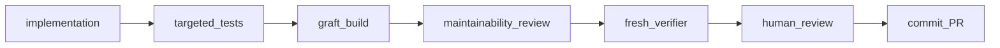
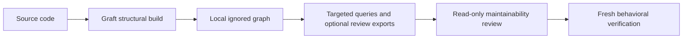

## Context

See `proposal.md` for scope and `intent.md` for user-accepted decisions.
Architecture and capability deltas accepted by the user on 2026-09-10.
Navigation revised with user approval on 2026-09-11: use Graft in place of
custom CODEMAP generation and its committed artifact.
Program design and task groups are reviewed separately before implementation.

Phase 1 inspection at main `35d871f` confirmed:

| Contract | Existing implementation |
|---|---|
| Tier routing and human gates | `FACTORY.md`, root `CLAUDE.md` |
| DEEP program design | `.claude/skills/shape-change/SKILL.md` |
| One group/branch/PR and selective context | `.claude/commands/dev-change.md`, its shell preamble |
| Fresh read-only verifier | `.claude/agents/verifier.md` |
| Quiet non-mutating full gate | `.harness/scripts/cmd_check.sh`, `lib/run_quiet.sh` |
| Template version and upstream history | `.harness/TEMPLATE_VERSION` (1.5.0), `template-manifest.json` |
| Manifest generation | `.harness/scripts/generate_template_manifest.py`, `make manifest` |
| Adoption precursor | `.harness/scripts/migrate_to_framework.py` |
| Update precursor | `.claude/skills/setup-update/scripts/setup_update.py` |
| Installation stamps | `.claude/template-version.json`, migration report |
| Static and prompt evals | `.harness/evals/`, `make evals`, `make evals-full` |

These are source inspection findings, not new execution-test results. The Phase 1
report records prior verification. Phase 2 must produce its own evidence.

## Goals / Non-Goals

Keep language-neutral configuration, deterministic factory-owned tooling, and small
modules under the existing harness. Maintain one ownership authority for both
old and new lifecycle entry points. Make navigation inexpensive and review
concerns concrete. Preserve all Phase 1 stage and shipping boundaries.

Exclude a language server, perfect dynamic call graphs, automatic refactoring,
AI merges, Wayfinder, package-release infrastructure, and new workflow-state
documents. Python remains the growth-check adapter. Graft owns navigation analysis; report
its actual supported scope rather than promising universal coverage.

## Decisions

### Runtime and interface

Use Python 3.12+ across tooling, dependency metadata, lockfile, Ruff, mypy, CI,
setup checks, and documentation. Standalone CLI entry points check the runtime
and explain how to obtain a supported interpreter. Hooks retain their existing
security behavior during migration.

Provide a repository-root `factory` executable, backed by cohesive modules under
`.harness/`, with doctor, maintainability, adopt, and update subcommands.
Document `./factory` as the portable invocation; no global installation or PATH
mutation is required. Keep `make manifest` as the existing refresh operation.
Existing migration/update scripts delegate to the shared lifecycle engine.
Navigation uses upstream `/graft` and the Graft CLI, not a `factory map` alias.
Graft advertises Node.js 20+, but the selected lockfile requires Node.js 22.12+; its package/runtime remain separate from downstream
application dependencies. Select and test a pinned release during integration.

### Configuration and installation metadata

Extend `.harness/template-manifest.json` with a schema version, defaults, and
ownership metadata. Preserve `template_version`, file hashes, and hash history.
Put project overrides in its clearly separated project configuration section.
Record the tested Graft dependency and integration contract in factory metadata;
leave graph format and navigation settings with Graft rather than inventing a
parallel annotation store. Manifest regeneration preserves these overrides;
updates merge factory metadata without replacing project configuration.

Keep `.harness/TEMPLATE_VERSION` as the version source; a completed Phase 2
release uses 2.0.0 because runtime and ownership contracts change. Do not add a
second human configuration file or a redundant version authority.

Use `.factory/state.json` only for installation metadata: installed version and
upstream fingerprints for owned files or sections. It contains no task status.
Unknown schema versions fail with remediation rather than guessed parsing.

### Code-line accounting and growth

Use Python tokenization and AST docstring locations to count physical lines
containing code, excluding blank lines, comment-only lines, and docstring-only
lines. A line containing code plus a comment or docstring still counts. Regular
multiline string data is code, not documentation. Syntax errors are reported as
analysis failures rather than interpreted as zero lines.

Retain physical LOC separately from growth-policy code lines. Discover tracked and
non-ignored untracked source, including hidden harness tooling. Ignore deleted
files, caches, vendored dependencies, and generated artifacts through documented
source classification and explicit reasoned exceptions. Do not follow symlinks
outside the repository or inspect environment-secret files.

During verification compare the working tree, including staged/unstaged and
untracked changes, with the merge base resolved by the existing base-branch
contract. Preserve rename identity where Git identifies it so moving an existing
large module does not automatically make it a new pathological file. Missing
comparison history must be explicit; full-repository inspection can warn about
existing sizes but must not invent growth evidence.

| Condition, without exception | Outcome |
|---|---|
| At most 300 code lines | Pass |
| More than 300, at most 500 | Warning |
| New file with more than 500 | Failure |
| Existing file with more than 500 and at least 150 net added lines | Failure |
| Existing file with more than 500 and smaller growth | Warning |
| Deleted file | Ignore |
| Valid path-specific exception | Report exception and reason; exempt from size failure |

Thresholds and enabled state are configurable. Validate positive integer values,
warning below maximum, and a positive substantial-growth threshold. Exact-path
exceptions require nonempty reasons, existing regular files, unique normalized
paths, and repository containment. V1 rejects wildcard exception entries; an
explicit project-wide disabled setting is visible and distinguishable from a
malformed configuration. Exceptions are checked-in reviewer-visible decisions,
not something the implementation agent silently grants itself to pass a gate.

### Maintainability review and lifecycle

Keep the short policy in harness documentation and reference it at relevant
stages. New DEEP program designs require Code Shape: reused modules, new modules
and public surfaces, modules intentionally not extended, and rough footprint.
Do not retrospectively rewrite accepted Phase 1 designs. STANDARD can abbreviate
this in design.md.

The fresh read-only reviewer discovers the diff, relevant accepted design,
immediate neighbours, and deterministic growth output. It receives identifiers,
not implementation narrative. It reports PASS or CONCERNS with M-identifiers,
locations, problems, consequences, and specific directions. Structural drift,
duplication, coupling, or needless abstractions are review concerns; they do not
independently prove behavioral failure. Return concerns to the implementer or
human; the reviewer never edits. Avoid speculative interfaces, frameworks,
one-function fragmentation, and generic utilities.

FAST can skip the semantic reviewer; deterministic growth still joins the full
gate. Doctor must never call make check. Structural Graft build occurs once at completion,
not in a post-tool hook. Human review reads specs, design, relevant Graft impact evidence, diff, and
both review outputs. Preserve the existing verifier/shipping full-gate ownership.

### Graft navigation and review evidence

Delegate navigation to [trailhq/Graft](https://github.com/trailhq/Graft), exposed
through its `/graft` skill and CLI. Remove the custom Python navigation analyzer,
normalized graph schema, Markdown/Mermaid renderer, `project.codemap` annotations,
`factory map`, and committed CODEMAP artifacts from the deliverables. Keep the
Python source counter used by the already-merged maintainability gate.

The chosen contract is local navigation, not a checked-in snapshot: build the
structural graph before review, inspect it progressively, and attach relevant
on-demand impact reports or exported visualization to human review when useful.
There is no requirement to produce an export for every small change. OpenSpec
remains behavioral truth; designs explain intent; source is implementation truth;
Graft is navigation evidence. Optional generated summaries are not authoritative.

Graft owns its git-ignored cache, upstream graph schema and skill. The factory
owns only the pinned dependency integration, lifecycle guidance and checks.
Do not vendor a fork of its parser or duplicate its concept/annotation store.
Its semantic `--deep` processing remains explicitly opt-in and outside mandatory
credential-free gates. Structural navigation must work without model credentials.

Preview initialization before applying it. Keep wiring repository-local, preserve
existing instructions and statusline, disable automatic hooks, and avoid global
agent-configuration changes. Validate the selected release's initialization flags
rather than assuming upstream defaults fit this harness. Do not turn on automatic
context injection or graph mutation in fresh reviewer sessions.

Implementation runs `graft build` at the completion boundary. Reviewers run
`graft check` and retrieval with `--no-refresh` or `GRAFT_NO_REFRESH=1`.
Stale/missing cache returns control to the implementer; reviewers never build it.
CI creates its own structural cache as preparation, then checks freshness. A
fresh cache check proves local freshness, not a committed artifact's currency.
Human review can use `graft blast` output or visualization exports; no automatic
PR comments, publishing or browser launch is required.

Documentation basis: [upstream CLI and integration](https://github.com/trailhq/Graft#cli)
and [runtime dependency](https://github.com/trailhq/Graft/blob/main/package.json).
Group 2 validates the installed release through fixture tests; this includes
compatibility check before committing to installation wiring.

### Ownership, adoption, and update

Use the existing manifest allowlist as the starting inventory, then classify
each entry as full-file ownership, bounded-section ownership, or preserve.
Factory policy, shipped commands/hooks, and runtime modules can be fully owned.
Root instructions and Makefile additions use named marker regions. Project
source, existing CI, and project documentation remain project-owned. Existing
JSON hook configuration requires a structural merge retaining unrelated values;
conflicting factory hook settings are surfaced, not overwritten.

Adopt accepts an explicit target and local template checkout. Initial source
distribution remains a local checkout, matching the existing scripts; no network
fetch or new registry is needed. Inspection proposes detected build/test tools
and preserves canonical commands. Python is the first fully supported adoption
path; other detected stacks receive conservative plans with unsupported steps
identified, never fabricated checks or wholesale Python project replacement.

Default adopt/update invocations are read-only plans listing ADD, MERGE,
PRESERVE, CONFLICT, and SKIP. `--apply` rechecks the plan against current input.
All conflicts are found before writes; an unresolved conflict prevents apply.
Require a clean committed target Git worktree for mutation, record its recovery
commit, and leave resulting changes uncommitted. Reject unsafe paths, symlink
escapes, malformed marker regions, and unsupported ownership metadata before
writing. Never claim ownership outside the explicit inventory.

Install required OpenSpec directory structure without copying upstream specs or
claiming CLI-managed OpenSpec artifacts. Automatically run doctor after apply;
report failed postchecks with recovery instructions and never claim success.

Updates compare each local file/section and proposed upstream content with its
recorded upstream fingerprint:

| Local changed | Upstream changed | Action |
|---|---|---|
| No | No | Preserve |
| No | Yes | Replace owned content |
| Yes | No | Preserve local content |
| Yes | Yes | Conflict, unless local already equals new upstream |

Treat local deletion as a local change. For dual changes, reporting a conflict is
the v1 deterministic strategy; a three-way merge is optional in the source brief
and would require storing retrievable base content. Do not add that machinery
until it is justified. Bounded-section updates preserve all surrounding bytes.
Advance fingerprints only for successfully reconciled entries; a conflict must
not be hidden by updating its baseline or installed-version stamp.

Legacy hash matches can identify pristine files; unmatched legacy contents remain
customizations. The first conversion previews new ownership and baseline state.
Recognize legacy version stamps for migration, then use the shared state model.
Keep legacy script paths and dry-run options, with clear deprecation guidance;
reject legacy `--force` when it requests forbidden overwrite behavior.

### Doctor, dogfooding, and validation

Doctor independently validates manifest/version/state consistency, directories,
commands and hook wiring, applicable executable bits, OpenSpec structure,
gitignore and secret protections, maintainability settings and exceptions,
Graft dependency/wiring and local-cache freshness, and eval configuration. Findings identify a path,
severity, and remediation. Invalid installation structure fails; stale navigation
is a warning in doctor and a failure in explicit `graft check`. Missing Graft
or incompatible wiring is an installation error. Doctor never builds the cache
or installs a dependency.

The starter uses the same installation contracts; make manifest refreshes both
distribution metadata and starter baselines deterministically. Doctor validates
owned content against expected metadata without treating recorded downstream
customizations as corruption. Add doctor to the full gate and CI without a loop.

Use semantic fixture tests for line boundaries, comments/docstrings, grandfathered
growth, exceptions, renames, Graft adapter contracts and read-only queries,
adoption preservation, clean-worktree requirements, and the update truth table.
Test conflicting and missing metadata, deleted files, changed marker sections,
and unknown legacy customizations. Static evals verify lifecycle and read-only
review contracts. Prompt evals cover only agent behavior that static checks
cannot establish; report authentication gaps honestly.

## Risks / Trade-offs

- A 500-code-line limit may encourage fragmentation → short cohesion policy,
  explicit exceptions, and a reviewer that discourages needless abstraction.
- Net growth does not detect large rewrites of unchanged size → semantic review
  covers responsibility and duplication; line checks remain a narrow signal.
- Growth remains Python v1; Graft has its own language coverage → report each
  tool’s scope separately and validate application coverage and factory/harness exclusion on a real fixture.
- External CLI/skill behavior can change → pin a tested release, preview wiring,
  and test cache, hook, statusline and read-only boundaries before upgrades.
- One manifest holds generated metadata and project settings → separate fields,
  preserve overrides on regeneration, and test update behavior.
- Legacy ownership is ambiguous → preview conflicts; never infer permission to
  replace customized whole files or claim existing project content.
- Filesystem failure after writes start → clean Git baseline plus documented
  created paths and recovery instructions; report partial failure, not success.
- Full Phase 2 is too broad for a casual single PR → shape independently
  shippable groups after architecture acceptance; do not conflate branch creation
  with approval to implement every future group on that branch.

## Migration Plan

After architecture acceptance, prepare Code Shape and independently shippable
groups with tests and integration in each. Keep the first group on the created
`feat/factory-phase2-g1`; later dependent groups wait for their prerequisites.
Preserve Phase 1 change artifacts. Upgrade runtime and contracts together where
their shipping boundary requires it. Update the manifest using make manifest,
build the Graft structural cache at implementation completion, and run independent reviews.

Downstream adoption/update apply remains explicit and produces uncommitted Git
changes. Humans inspect the printed actions, resulting diff, doctor, Graft freshness check,
and relevant eval evidence before committing. Rollback restores only paths and
managed regions reported by the operation from the recorded clean Git baseline;
no automatic reset, clean, or hidden backup directory is introduced.

### Application-only navigation scope — 2026-09-11

The user clarified that Graft graphs cover the main project implementation only.
Exclude factory and harness tooling, including tooling outside hidden directories.
Use upstream scope controls to select application source roots; do not infer graph
scope from dot-directory exclusion alone. This does not narrow source-growth
enforcement or independent source review of factory changes.

No-application behavior accepted 2026-09-11: when no application sources are
configured, report `not applicable: no application sources configured`. Validate
Graft against an application fixture; retain tooling growth and behavioral gates.
Document `/graft` usage in HARNESS.md.

### Approved skill-only integration — 2026-09-11

Graft 0.18.0's Claude installer adds hooks despite `--no-hooks`. The user approved
installing only its unchanged upstream skill and isolated CLI. Preview skill
installation, preserve customized skill files, and do not run upstream `init`.
The generated skill stays upstream-owned and ignored; `make graft-install`
regenerates it from the locked package without hooks, MCP or global agent wiring.

The factory's `.harness/bin/graft` launcher delegates through `factory navigation`
to the thin `graft.py` boundary. `project.navigation.application_roots` in the
existing manifest records the explicit application input list (empty in this
starter), forwarded as upstream `--only-dir` options. Graft still owns all graph
and cache formats. The launcher checks the pinned release, disables dotenv and
query refresh. Upstream owns fingerprint selection and validation; the wrapper
does not inspect fingerprint files. Changing application roots requires an
explicit build before review because upstream checks the last-built scope.
This input list is not an alternate graph/configuration store. Supported review
commands are check, ask, grep, skeleton, callers, map and blast; structural build
and explicit optional `build --deep` belong to the implementer. Upstream visual
exports remain optional, outside the required read-only command surface.
